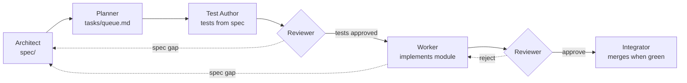
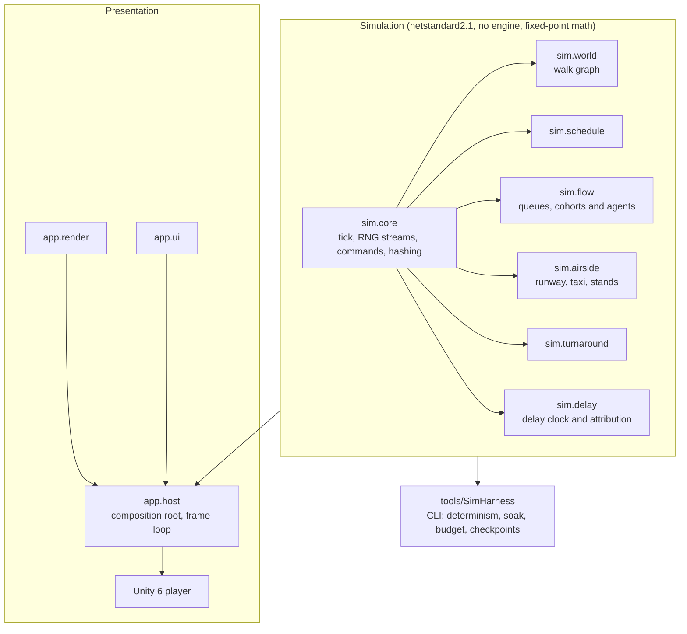

# ✈️ Airport Sim

**A top-down airport management game, built by a team of AI agents under one human owner.**

You run an airport through a published daily flight schedule. Two coupled
networks share the pressure: **airside** (runways, taxiways, stands, turnaround
crews) and **landside** (check-in, security, walking routes, gates). Bad
decisions don't fail instantly. They fail at peak, and every delayed minute
traces back to a visible cause.

> **Status (October 2026):** Phase 1, the "fun prototype", is close to its first
> playtest. The deterministic simulation core, passenger flow, airside movement,
> turnaround jobs and delay attribution are merged and tested. The headless
> host and the Unity front end are being built now. There is no playable build
> yet.

---

## Design pillars

1. **Flow over placement.** A gate is only as good as the walk to it.
2. **Structural time pressure.** The published schedule is the clock.
3. **Legible failure.** Every delayed minute traces to a visible cause.
4. **Airlines are partners with personalities**, not anonymous demand.

The non-goals are written down too, so no agent ever proposes them: this is
**not** an air traffic control sim, not a flight sim, not a city builder, and
has no multiplayer at 1.0.

---

## How it was built

This repository is an experiment in **spec-driven, multi-agent software
development**. Nearly all of its code, tests, spec and task files were written
by [Claude Code](https://claude.com/claude-code) agents, each playing one
narrow role. The human owner sets the direction, decides anything that shapes
the player's experience, and holds the locked architecture documents.

### The team

| Role | Writes | Never touches |
|---|---|---|
| **Architect** | `spec/`: interfaces, data formats, rulings on open questions | game code |
| **Planner** | `tasks/`: the dependency-ordered queue and per-task briefs | code, tests |
| **Test Author** | tests, written **from the spec, before any implementation exists** | `src/` |
| **Worker** | one module's implementation, in its own git worktree | tests, spec |
| **Reviewer** / **Core Reviewer** | a verdict on the diff against the spec. The core reviewer covers determinism-critical code | anything |
| **Integrator** | the merge, and only after every gate is green | anything else |
| **Manager** | releases tasks, routes reports, keeps agents busy within resource limits | spec, code |
| **Human owner** | `spec/01-architecture.md`, `spec/02-determinism.md`, balance, scope, "is it fun?" | — |

The Test Author and the Worker are always different agents. The Reviewer sees
only the diff and the spec, never the Worker's reasoning.

### The pipeline



When an agent hits something the spec doesn't cover, it doesn't guess. It
files the gap, and the Architect resolves all of one task's gaps in **one**
spec PR. The CLAUDE.md rule: *"A stopped agent is cheap. A confidently wrong
agent is expensive."*

### Guardrails

Agents are fast and confident, so the project leans on mechanical checks
rather than trust:

- **Path guards, three of them.** A pre-tool hook (`ci/hooks/guard-paths.sh`)
  blocks an agent from writing outside its role's directories, during its turn.
  A CI job (`ci/check-paths.sh`) re-checks every PR against the writable paths
  in its task file. Branch protection on GitHub is the final word.
- **Determinism gates, on every PR.** The same seed must give bit-identical
  state on the same process, across processes, and through save and load.
  Promoting passenger cohorts to individual agents and back must not change the
  outcome. The `determinism` check is required for every merge.
- **A 500-day soak** against golden hashes, and **performance budgets**
  (6 ms per tick at the largest tier, split across modules).
- **Kill gates.** Phase 0 had to run 100 simulated days in under 60 seconds,
  identical across runs, or the architecture would be redesigned. It passed.
  Phase 1 ends in a human-only gate: *is unblocking flow fun with no
  construction at all?* No agent may mark that task complete.
- **Blocking-only reviews.** Reviewers reject only real defects. Wording nits
  go to a follow-up list instead of another round.

---

## Architecture

The simulation is a **plain .NET library with zero engine references**
(`netstandard2.1`, C# 9). Unity 6 LTS is only the presentation layer, and
imports the sim as a compiled assembly.



Why keep the engine out of the sim?

1. **The determinism gates stay trivial to run.** `dotnet test` runs the whole
   sim in CI with no engine, licence, GPU or display. A gate that's hard to run
   is a gate that gets disabled.
2. **The soak test is possible at all.** 500 simulated days run in minutes.
3. **The compiler enforces layer separation.** Sim code *cannot* call rendering,
   because it has no reference to it.

The sim runs at a fixed 10 Hz tick. It uses no floating point (only the `Fx`
fixed-point type), draws all randomness from per-system seeded streams, and
never reads the wall clock. A separate, non-blocking CI job builds the Unity
player and checks that its checkpoint output is **byte-identical** to the
.NET harness's.

---

## Repository tour

```
CLAUDE.md          the five rules every agent reads first
agents/            role briefs (architect, planner, test-author, worker, reviewer, ...)
spec/              the source of truth: architecture, determinism, interfaces, open questions
tasks/             queue.md (dependency order) and one brief per task
src/sim/           the simulation modules
src/app/           render and UI scene layers (engine-free), host
tools/SimHarness/  headless CLI: determinism gates, soak, budgets, checkpoint dumps
tests/             unit, integration, budget and golden-hash tests
data/              content: aircraft, size categories, profiles, balance
unity/AirportSim/  Unity 6 project shell (6000.3.25f1)
ci/                check script, path guards, content validator
```

---

## By the numbers

Two and a half weeks in (first commit 2026-09-20):

| | |
|---|---|
| Pull requests merged | 120+ |
| Commits | 600+ |
| Tasks specified | 44 |
| Spec questions raised and ruled on | 114 |
| Spec | ~18,500 lines across 20 documents |
| Simulation and tools code | ~22,000 lines of C# |
| Tests | ~1,100 test methods, ~53,000 lines |

The test code is more than twice the size of the code it tests. That's what
"tests from the spec, before the implementation" looks like in practice.

---

## Building and running

You need the [.NET 8 SDK](https://dotnet.microsoft.com/download). Unity is only
needed for the player build.

```bash
# Build and run the fast checks (build, tests without the Slow ones, static analysis, content, path guard)
SKIP_SLOW=1 bash ci/run-checks.sh --fast

# The full run: all tests (Slow ones too), the determinism gates and the 6 ms budget
bash ci/run-checks.sh

# Drive the simulation headlessly
dotnet run --project tools/SimHarness -c Release -- determinism --days 10 --seed 12345
dotnet run --project tools/SimHarness -c Release -- soak --days 500 --golden tests/golden/soak-500.hashes
dotnet run --project tools/SimHarness -c Release -- budget --tier max
```

The static analysis step enforces the rules in plain `grep`. It rejects any of
these in `src/sim`: `System.Random`, `DateTime.Now`, `float` or `double`,
iteration over a `Dictionary`, and any reference to Unity.

---

## Lessons learned

- **The spec is the bottleneck, and the leverage.** Most rework came from gaps
  the spec didn't cover, not from bad code. Batching every gap one task finds
  into a single Architect PR cut review rounds sharply.
- **Write tests first, but start coding early.** Tests that are refined many
  times without ever running against real code drift. The Worker now starts as
  soon as the core tests are approved, and edge cases come after the first
  green run.
- **Check that content ids resolve before pinning a fixture.** The same bug
  slipped through twice: a fixture used size categories the shipped content
  didn't define.
- **Timing tests flake on shared CI runners.** Budget tests now run on their
  own, one at a time.
- **Tokens are a budget too.** Short targeted briefs, one report per task, a
  code knowledge graph for navigation, and no re-reading of huge files made a
  real difference.
- **Determinism is cheap to keep and expensive to recover.** Every gate has
  stayed on since day one.

---

## Roadmap

```
T-031 headless host ─▶ T-032 render + T-033 UI Unity backends ─▶ T-034 Unity shell + playtest bundle ─▶ T-025 PLAYTEST (human gate)
```

After the playtest, if the answer is "yes, it's fun", the build order continues:
money, staff, policy and reputation, incidents, progression, tutorial. That
order is fixed. Delay attribution came deliberately before the economy, because
every balance decision afterwards depends on seeing why things failed.

---

<sub>Built with <a href="https://claude.com/claude-code">Claude Code</a>. One human, a lot of agents, and a very strict CLAUDE.md.</sub>
